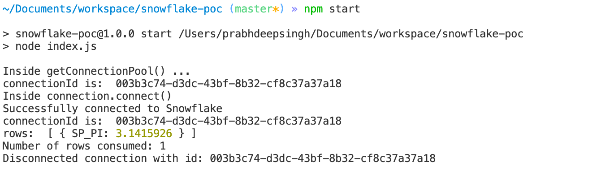

# Snowflake POC

## Why?
- Can Stored Proc be executed from an API?
- Establish that connecting to Snowflake is easy.

## Limitation of this code
- This doesn't use ConnectionPool, though it can be easily implemented.
- Stored Proc is not being created from this code

## Pre-requisite

Create a Stored Procedure in your DATABASE, in your SCHEMA

```
CREATE OR REPLACE PROCEDURE DEEP.PUBLIC."SP_PI"()
RETURNS FLOAT
LANGUAGE JAVASCRIPT
EXECUTE AS OWNER
AS 'return 3.1415926;';
```

## Steps
- Clone this repo
- Install dependencies by running following command
    ```npm install```
- Create a .env file in the root and add following:
    ```
    accessUrl="<your-access-url>"
    authenticator="<your-authenticator>"
    account="<your-account>"
    username="<your-username>"
    password="<your-password>"
    database="<your-database>"
    schema="<your-schema>"
    ```
- Run following command to see it in action
    ```npm run```

## Output


